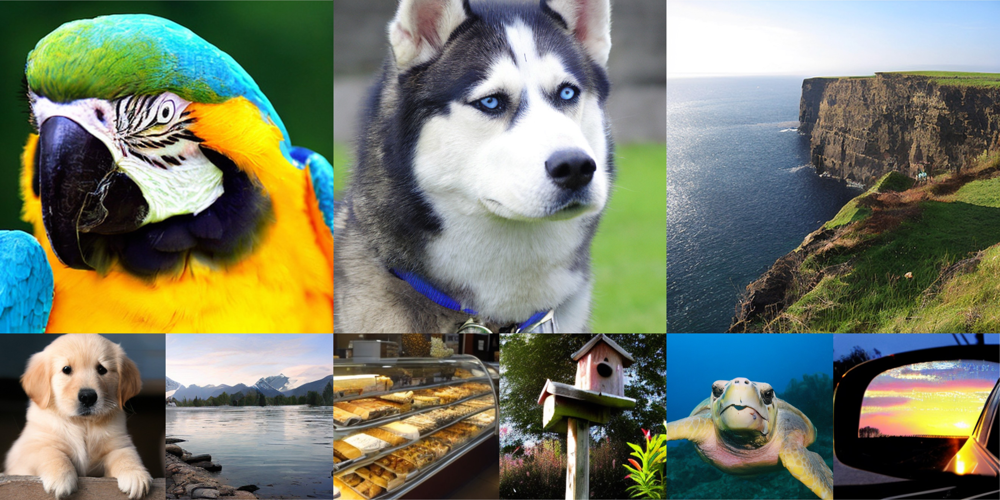
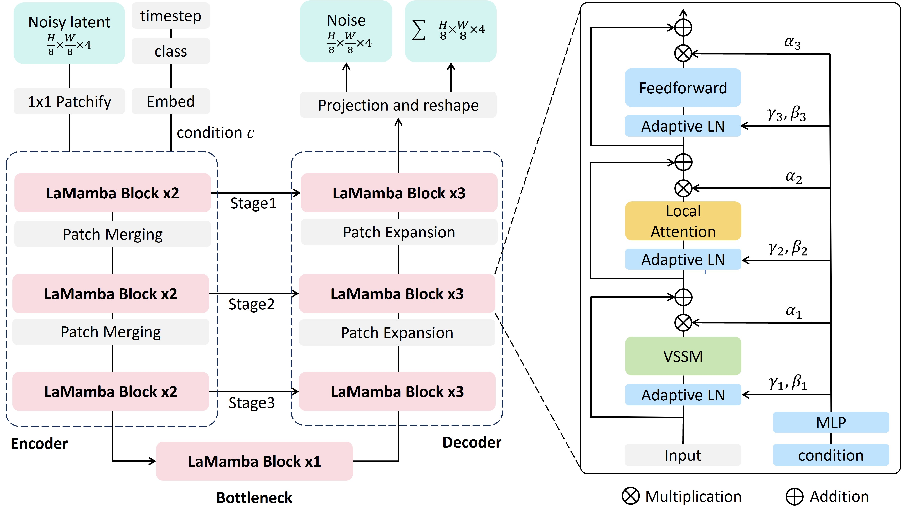

# LaMamba-Diff
This is the official repository for [LaMamba-Diff: Linear-Time High-Fidelity Diffusion Models Based on Local Attention and Mamba](https://arxiv.org/pdf/2408.02615).  

## Introduction
Recent Transformer-based diffusion models have shown remarkable performance, largely attributed to the ability of the self-attention mechanism to accurately capture both global and local contexts by computing all-pair interactions among input tokens. However, their quadratic complexity poses significant computational challenges for long-sequence inputs. Conversely, a recent state space model called Mamba offers linear complexity by compressing a filtered global context into a hidden state. Despite its efficiency, compression inevitably leads to information loss of fine-grained local dependencies among tokens, which are crucial for effective visual generative modeling. Motivated by these observations, we introduce Local Attentional Mamba (LaMamba) blocks that combine the strengths of self-attention and Mamba, capturing both global contexts and local details with linear complexity. Leveraging the efficient U-Net architecture, our model exhibits exceptional scalability and surpasses the performance of DiT across various model scales on ImageNet at 256x256 resolution, all while utilizing substantially fewer GFLOPs and a comparable number of parameters. Compared to state-of-the-art diffusion models on ImageNet 256x256 and 512x512, our largest model presents notable advantages, such as a reduction of up to 62% GFLOPs compared to DiT-XL/2, while achieving superior performance with comparable or fewer parameters.


## Requirements
- Python 3.12.3
```
conda create -n lamamba python=3.12.3`
```
- torch 2.3.0 + cuda12.1
```
conda install pytorch torchvision pytorch-cuda=12.1 -c pytorch -c nvidia
```

- Pip requirements:
```
pip install -r requirements.txt
```

- VSSM
```
cd kernels/selective_scan
pip install -e .
```


## Data Preparation
Download [ImageNet-1k](https://www.image-net.org/download.php) andn extract it using this [script](https://gist.github.com/BIGBALLON/8a71d225eff18d88e469e6ea9b39cef4).

## Training
We provide a training script  (`train_lamamba.sh`) to train unconditional and class-conditional LaMamba-Diff models.
```
bash train_lamamba.sh
```

## Sampling
We include a `sample.sh` script to generate images.
```
bash sample.sh
```

## Acknowledgements
Our implementation is mainly based on [DiT](https://github.com/facebookresearch/DiT),  [VMamba](https://github.com/MzeroMiko/VMamba), and [Swin Transformer](https://github.com/microsoft/Swin-Transformer) for local attention. We gratefully thank the authors for their wonderful works.

## Citation
If you find this project useful for your research, please consider citing:
```
@article{fu2024lamamba,
  title={LaMamba-Diff: Linear-Time High-Fidelity Diffusion Models Based on Local Attention and Mamba},
  author={Fu, Yunxiang and Chen, Chaoqi and Yu, Yizhou},
  journal={arXiv preprint arXiv:2408.02615},
  year={2024}
}
```
